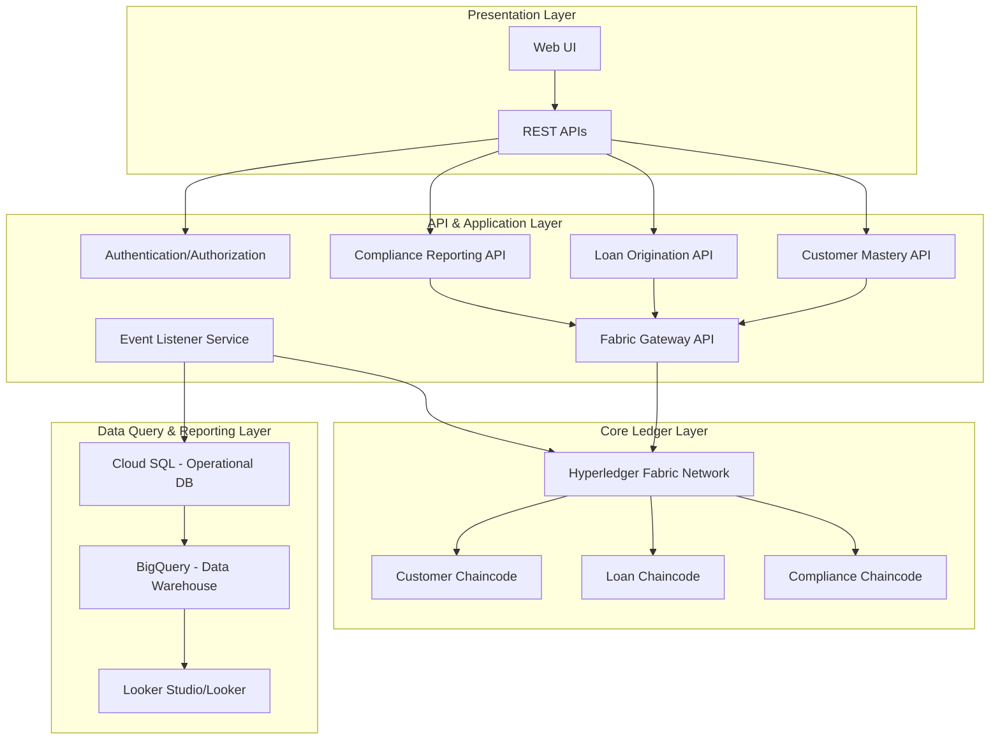

# Design Document

## Overview

The Unified Blockchain Platform for Financial Institutions is a comprehensive solution built on Hyperledger Fabric that addresses critical pain points in legacy financial institutions. The platform implements a three-tiered architecture with immutable blockchain storage, API-driven application services, and robust data warehousing capabilities.

The solution focuses on three core business domains:
- **Loan Origination**: Streamlined, auditable loan processing with automated workflows
- **Customer Mastery**: Single source of truth for customer data with complete history tracking
- **Compliance & Regulatory Reporting**: Automated rule enforcement and real-time regulatory transparency

## Architecture

### High-Level Architecture

The system follows a three-tiered architecture pattern:



### Technology Stack

- **Blockchain**: Hyperledger Fabric 2.x
- **Smart Contracts**: Go chaincode
- **API Layer**: Python/FastAPI
- **Operational Database**: Cloud SQL (PostgreSQL)
- **Data Warehouse**: BigQuery
- **Container Orchestration**: Google Kubernetes Engine (GKE)
- **API Gateway**: Google Cloud Run
- **Authentication**: OAuth 2.0 / JWT
- **Monitoring**: Cloud Logging, Cloud Monitoring

## Components and Interfaces

### Core Ledger Layer

#### Hyperledger Fabric Network
- **Peers**: Multiple peer nodes for redundancy and consensus
- **Orderers**: Raft-based ordering service for transaction ordering
- **Certificate Authority**: Fabric CA for identity management
- **Channels**: Separate channels for different business domains

#### Chaincode Components

**Customer Chaincode (Go)**
```go
type Customer struct {
    CustomerID      string    `json:"customerID"`
    FirstName       string    `json:"firstName"`
    LastName        string    `json:"lastName"`
    DateOfBirth     time.Time `json:"dateOfBirth"`
    NationalID      string    `json:"nationalID"` // Encrypted/Hashed
    Address         string    `json:"address"`
    ContactEmail    string    `json:"contactEmail"`
    ContactPhone    string    `json:"contactPhone"`
    KYCStatus       string    `json:"kycStatus"`
    AMLStatus       string    `json:"amlStatus"`
    ConsentPrefs    string    `json:"consentPreferences"`
    CreationDate    time.Time `json:"creationDate"`
    LastUpdated     time.Time `json:"lastUpdated"`
    UpdatedByActor  string    `json:"updatedByActor"`
}
```

**Loan Chaincode (Go)**
```go
type LoanApplication struct {
    LoanApplicationID   string    `json:"loanApplicationID"`
    CustomerID          string    `json:"customerID"`
    ApplicationDate     time.Time `json:"applicationDate"`
    RequestedAmount     float64   `json:"requestedAmount"`
    LoanType           string    `json:"loanType"`
    ApplicationStatus   string    `json:"applicationStatus"`
    IntroducerID       string    `json:"introducerID"`
    CurrentOwnerActor   string    `json:"currentOwnerActor"`
    LastUpdated        time.Time `json:"lastUpdated"`
}

type LoanApplicationHistory struct {
    HistoryID           string    `json:"historyID"`
    LoanApplicationID   string    `json:"loanApplicationID"`
    Timestamp          time.Time `json:"timestamp"`
    ChangeType         string    `json:"changeType"`
    PreviousValue      string    `json:"previousValue"`
    NewValue           string    `json:"newValue"`
    ActorID            string    `json:"actorID"`
    TransactionID      string    `json:"transactionID"`
}
```

**Compliance Chaincode (Go)**
```go
type ComplianceRule struct {
    RuleID              string    `json:"ruleID"`
    RuleName           string    `json:"ruleName"`
    RuleDescription    string    `json:"ruleDescription"`
    RuleLogic          string    `json:"ruleLogic"`
    AppliesToDomain    string    `json:"appliesToDomain"`
    Status             string    `json:"status"`
    LastModifiedBy     string    `json:"lastModifiedBy"`
    LastModifiedDate   time.Time `json:"lastModifiedDate"`
}

type ComplianceEvent struct {
    EventID             string    `json:"eventID"`
    Timestamp          time.Time `json:"timestamp"`
    RuleID             string    `json:"ruleID"`
    AffectedEntityID   string    `json:"affectedEntityID"`
    AffectedEntityType string    `json:"affectedEntityType"`
    EventType          string    `json:"eventType"`
    Details            string    `json:"details"`
    ActorID            string    `json:"actorID"`
    IsAlerted          bool      `json:"isAlerted"`
    AcknowledgedBy     string    `json:"acknowledgedBy"`
    AcknowledgedDate   time.Time `json:"acknowledgedDate"`
}
```

### API & Application Layer

#### Service Architecture
Each domain has its own microservice following Domain-Driven Design principles:

**Customer Mastery API Service**
- Endpoints: `/customers`, `/customers/{id}`, `/customers/{id}/history`
- Functions: Create, update, retrieve customer records
- Integration: Customer Chaincode via Fabric Gateway

**Loan Origination API Service**
- Endpoints: `/loans`, `/loans/{id}`, `/loans/{id}/history`, `/loans/{id}/documents`
- Functions: Submit applications, update status, manage documents
- Integration: Loan Chaincode via Fabric Gateway

**Compliance Reporting API Service**
- Endpoints: `/compliance/events`, `/reports/regulatory`, `/regulator/view`
- Functions: Query compliance events, generate reports, provide regulatory access
- Integration: Compliance Chaincode and BigQuery

#### Authentication & Authorization
```python
class Actor:
    actor_id: str
    actor_type: str  # 'Internal_User', 'External_Partner', 'System'
    actor_name: str
    role: str  # 'Underwriter', 'Introducer', 'Compliance Officer'
    blockchain_identity: str  # x.509 Certificate ID
    permissions: List[str]
```

#### Event Listener Service
- Subscribes to Fabric chaincode events
- Transforms blockchain events to database updates
- Ensures data synchronization between ledger and operational database

### Data Query & Reporting Layer

#### Operational Database (Cloud SQL)
Mirrors blockchain data for fast querying:
- Customer table with current state
- LoanApplication table with current state
- Actor table for user management
- History tables for audit trails

#### Data Warehouse (BigQuery)
Implements dimensional modeling for analytics:

**Fact Tables:**
- `Fact_LoanApplication_Events`: Loan processing metrics
- `Fact_Compliance_Events`: Compliance monitoring metrics

**Dimension Tables:**
- `Dim_Customer`: Customer master data (SCD Type 2)
- `Dim_LoanApplication`: Loan application details
- `Dim_Actor`: User and system actors
- `Dim_Date`: Time dimension
- `Dim_ComplianceRule`: Compliance rule definitions

## Data Models

### Blockchain Data Model
The blockchain stores immutable records of all critical business entities with complete audit trails. Each entity includes:
- Unique blockchain-based identifiers
- Cryptographic hashes for document integrity
- Actor attribution for all changes
- Timestamp information for chronological ordering

### Operational Data Model
The operational database provides fast access to current state data:
- Normalized relational structure
- Foreign key relationships between entities
- Indexed for query performance
- Synchronized from blockchain via event listeners

### Analytical Data Model
The data warehouse implements star schema design:
- Fact tables for measurable business events
- Dimension tables for descriptive attributes
- Slowly Changing Dimensions for historical accuracy
- Conformed dimensions for cross-domain analysis

## Error Handling

### Blockchain Error Handling
- **Transaction Validation Errors**: Chaincode validates all inputs before state changes
- **Consensus Failures**: Fabric handles peer disagreements through endorsement policies
- **Network Partitions**: Raft consensus ensures availability during network issues

### API Error Handling
```python
class APIError(Exception):
    def __init__(self, status_code: int, message: str, details: dict = None):
        self.status_code = status_code
        self.message = message
        self.details = details or {}

# Standard error responses
HTTP_400_BAD_REQUEST: "Invalid input data"
HTTP_401_UNAUTHORIZED: "Authentication required"
HTTP_403_FORBIDDEN: "Insufficient permissions"
HTTP_404_NOT_FOUND: "Resource not found"
HTTP_500_INTERNAL_SERVER_ERROR: "Internal system error"
```

### Data Synchronization Error Handling
- **Event Processing Failures**: Retry mechanism with exponential backoff
- **Database Connection Issues**: Circuit breaker pattern
- **Data Consistency Checks**: Periodic reconciliation between blockchain and database

## Testing Strategy

### Unit Testing
- **Chaincode Testing**: Go unit tests for all chaincode functions
- **API Testing**: Python unit tests with mocking for external dependencies
- **Database Testing**: SQL unit tests for data access layer

### Integration Testing
- **Blockchain Integration**: Test chaincode deployment and invocation
- **API Integration**: Test end-to-end API workflows
- **Data Pipeline Integration**: Test event processing and synchronization

### Performance Testing
- **Load Testing**: Simulate high transaction volumes
- **Stress Testing**: Test system limits and failure modes
- **Latency Testing**: Measure response times under various loads

### Security Testing
- **Authentication Testing**: Verify access control mechanisms
- **Authorization Testing**: Test role-based permissions
- **Data Encryption Testing**: Verify encryption at rest and in transit
- **Audit Trail Testing**: Ensure complete traceability

### Compliance Testing
- **Regulatory Rule Testing**: Verify automated compliance enforcement
- **Audit Trail Testing**: Test immutability and completeness
- **Data Privacy Testing**: Verify GDPR/CCPA compliance
- **Reporting Accuracy Testing**: Validate regulatory report generation

### End-to-End Testing
- **Business Process Testing**: Test complete loan origination workflow
- **Cross-Domain Testing**: Test interactions between customer, loan, and compliance domains
- **Disaster Recovery Testing**: Test backup and recovery procedures